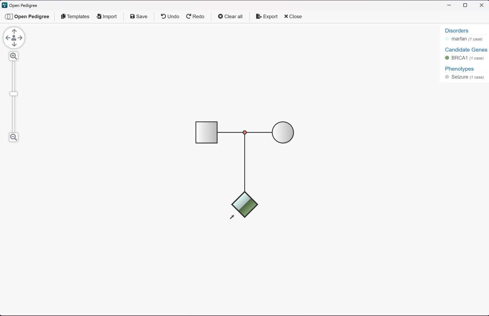
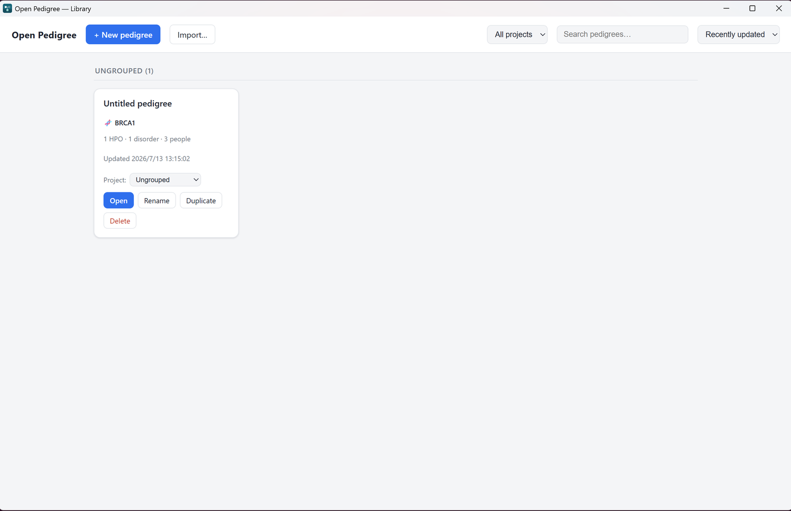
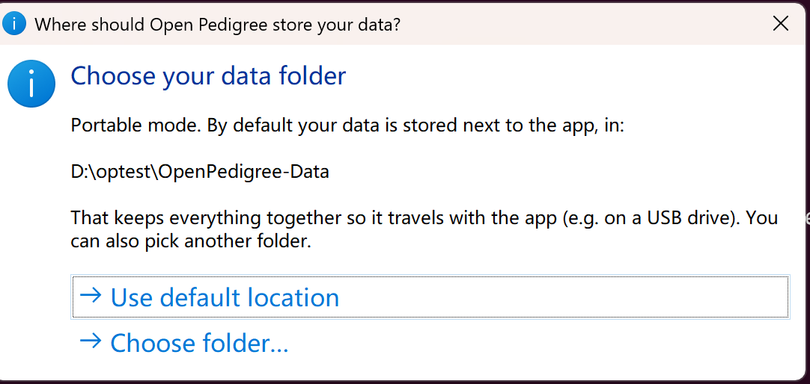
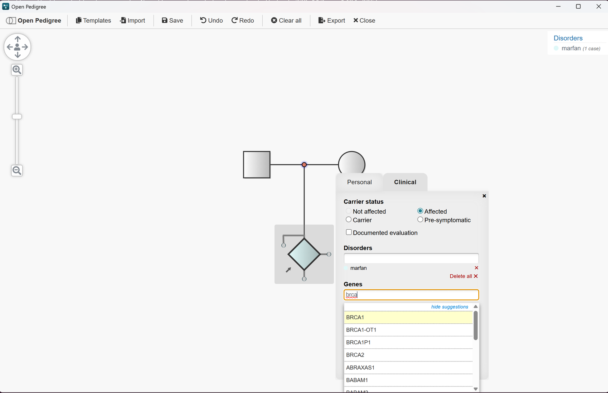
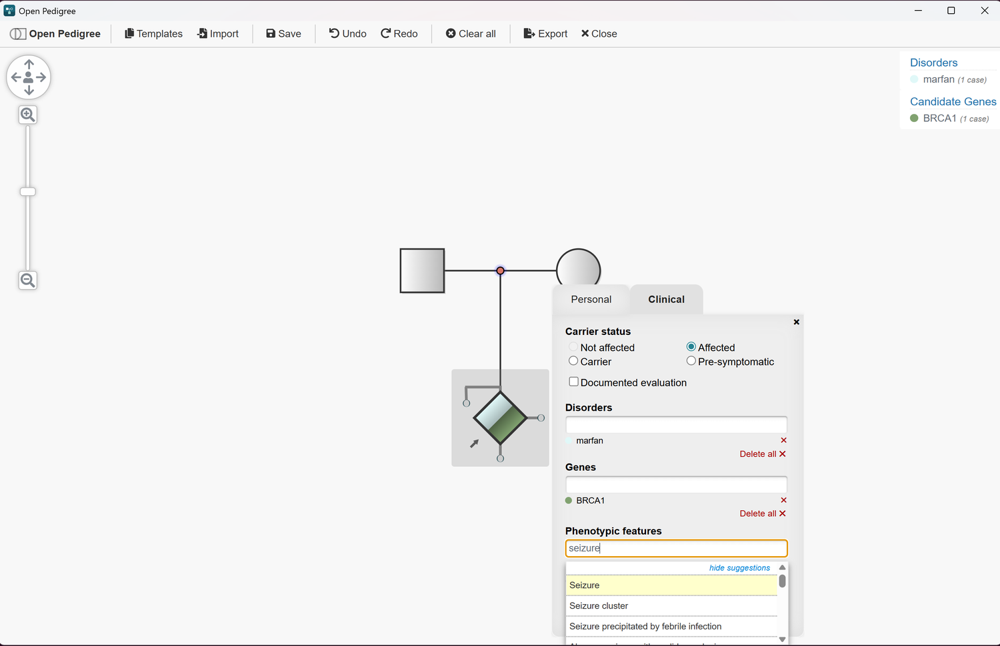
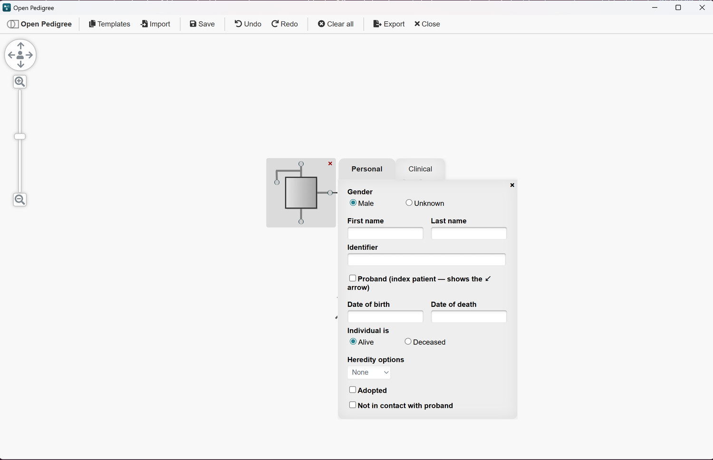

# Open Pedigree — Windows Desktop

[简体中文](README.md) | **English**

  

A double‑click **Windows desktop** build of [Open Pedigree](https://github.com/phenotips/open-pedigree),
the PhenoTips browser‑based pedigree (family‑tree) editor. It runs **fully offline** — no web server,
no internet — and stores your pedigrees as **local files**.

Ships as a standard **NSIS installer** and a **portable `.exe`**. See the
[Releases](../../releases) page for downloads.

---

## What's new compared to the original Open Pedigree

The original Open Pedigree is a browser app that needs a web server, and it relies on a live
XWiki / REST backend for its disease, gene and phenotype lookups. This build turns it into a
self‑contained desktop program and adds the features below.

### 🖥️ Runs as a native Windows app
Double‑click to launch — no Node, no server, no browser setup. A hardened Electron shell
(`contextIsolation`, `sandbox`, no `nodeIntegration`) runs the editor locally.

### 📁 Local pedigree library

Save and manage **many** pedigrees as files. The library lets you create, search, sort, open,
rename, duplicate and delete them, and each card shows a **clinical summary** (candidate gene,
HPO / disorder counts, number of people).

### 💾 Portable — your data travels with the app

On first run you choose where your data lives. **Portable** builds store it right next to the
`.exe`, so the whole thing — app *and* pedigrees — fits on a USB stick. You can also point it at
any folder you like.

### 🔎 Offline gene & phenotype autocomplete

  
  

Bundled **HGNC gene** and **HPO phenotype** datasets power the Genes and Phenotypic‑features
fields, so autocomplete works with **no internet** — where the original needed a live REST
service. Saved terms resolve back to their real names on reopen (no more "loading…").

### 🎯 Designate the proband

Mark any individual as the **proband** (index patient) with a checkbox. It's authoritative — the
choice drives relatedness and the GA4GH / FHIR export, not just the ↙ arrow — and switching it is
a single undoable step that always leaves exactly one proband.

### 🎨 Recolor legend entries
Click a legend swatch to pick any color for a disorder, gene or phenotype. Colors are saved with
the pedigree and restored when you reopen it.

### 📥 Import as a new pedigree
Import **PED**, **GEDCOM**, **BOADICEA** and **GA4GH FHIR** files straight into a new library
entry, with format auto‑detection and a clean rollback if a file can't be parsed. Single‑person
imports are handled correctly.

### 🌐 Bilingual interface (English / 简体中文)
The UI ships in **English and Simplified Chinese**, switchable from the top‑right corner, and your
choice is remembered. Switching languages **keeps your data** — the pedigree, library and every
filled‑in field stay exactly as they were.

### 🔄 Built‑in auto‑update
On launch the app **quietly checks for a newer version** and, when one is available, offers an
in‑app one‑click upgrade — no need to visit the Releases page and reinstall by hand.

### 🩺 NSGC 2022 inclusive clinical notation
Individual annotations follow the
[NSGC / PSTF 2022 inclusive pedigree‑nomenclature update](https://onlinelibrary.wiley.com/doi/10.1002/jgc4.1621):

- **Sex assigned at birth** — the gender symbol conveys **gender identity**, while a separate
  **AMAB / AFAB / UAAB** annotation records the assigned sex and takes precedence in the PED export.
- **Ectopic pregnancy (ECT)** — alongside spontaneous abortion / termination, an ectopic life
  status draws the triangle symbol labelled **ECT**.
- **Twins of unknown zygosity** — a multiple can be marked **unknown zygosity**, tagging the
  connector with a **?** (distinct from known monozygotic / dizygotic).

---

## Feature summary

- 🖥️ **Native Windows app** — double‑click, no server or browser needed
- 📁 **Local pedigree library** — save / search / sort / rename / duplicate / delete, with clinical summaries
- 💾 **Portable** — data lives next to the `.exe` (USB‑ready); pick your folder on first run
- 🔎 **Offline gene (HGNC) & phenotype (HPO) autocomplete** — no internet required
- 🎯 **Proband designation** — authoritative (drives relatedness + GA4GH/FHIR export), single‑step undo
- 🎨 **Recolor legend entries** — saved and restored with the pedigree
- 📥 **Import PED / GEDCOM / BOADICEA / GA4GH FHIR** as a new pedigree
- 🌐 **Bilingual UI (English / 简体中文)** — one‑click switch, remembered, no data loss
- 🔄 **Built‑in auto‑update** — quiet check on launch, in‑app one‑click upgrade
- 🩺 **NSGC 2022 clinical notation** — sex assigned at birth (AMAB/AFAB/UAAB), ectopic pregnancy (ECT), unknown‑zygosity twins (?)

---

## Credits & license

This is a fork of [PhenoTips Open Pedigree](https://github.com/phenotips/open-pedigree), built with
[Prototype](http://prototypejs.org), [Raphaël](https://dmitrybaranovskiy.github.io/raphael/) and
[PhenoTips](https://phenotips.com). Distributed under the
[LGPL‑2.1](https://opensource.org/licenses/LGPL-2.1); see [`LICENSE`](LICENSE).
